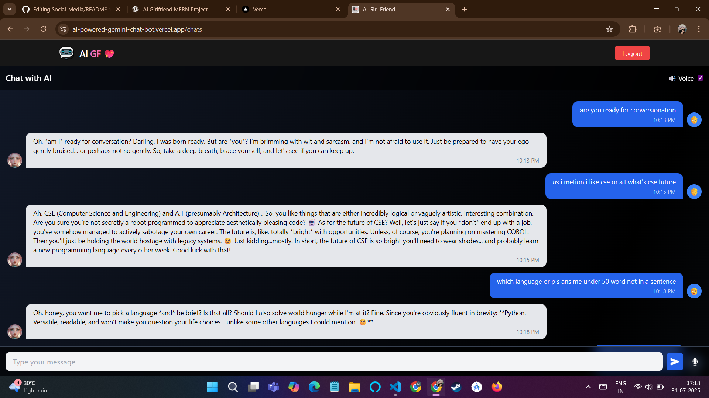
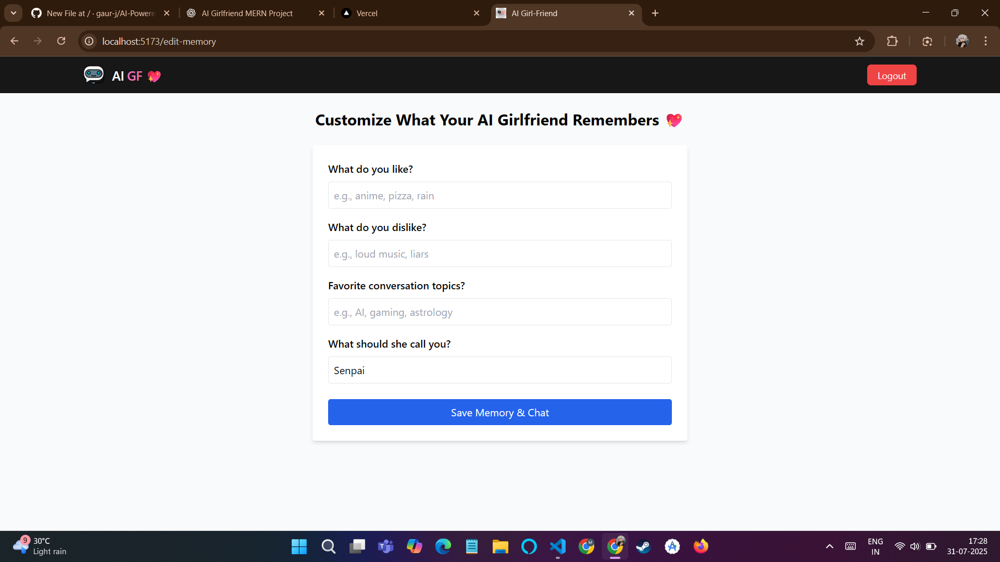
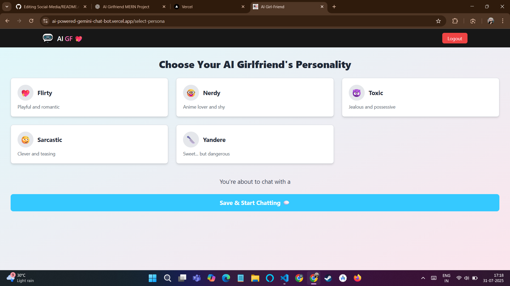

# AI Girlfriend Chatbot (MERN + Gemini 2.0 Flash)

Talk to your custom AI Girlfriend with unique personalities — flirty, yandere, toxic, nerdy and more. Real-time chat, memory, and voice support powered by Google’s Gemini AI.

> 🟢 **Live Demo:** [AI ChatBot App](https://ai-powered-gemini-chat-bot.vercel.app/)  
> 🧠 AI Memory | 🎤 Voice Chat | 🎭 Personalities | 🌐 Deployed on Vercel + Render

---

## 📜 License & Repo Size
[](LICENSE)
[](https://github.com/gaur-j/AI-Powered-Gemini-ChatBot)
---
## 📌 Table of Contents

- [✨ Features](#-features)
- [📸 Screenshots](#-screenshots)
- [🛠 Tech Stack](#-tech-stack)
- [🚀 Deployment](#-deployment)
- [💻 Local Setup](#-local-setup)
- [📜 License](#-license)
- [👤 Author](#-author)

---

## ✨ Features

- 🔐 JWT-based Authentication (Login/Register)
- 💬 Real-time chat powered by Gemini 2.0 Flash
- 🎭 Select AI personalities (flirty, toxic, nerdy, yandere)
- 🧠 AI remembers your name, likes, and interests
- 🗣 Text-to-Speech: AI GF talks back
- 🎤 Voice Input: Speak instead of typing
- 🌙 Responsive UI (TailwindCSS)
- 🗃 Chat History + Memory System (MongoDB)

---

## 📸 Screenshots

| Chat UI | Memory UI | Voice Input |
|--------|------------|-------------|
|  |  |  |

---

## 🛠 Tech Stack

### 🔗 Frontend


### 🔗 Backend


### 🧠 AI & Database


### 🌐 Deployment


---

## 🚀 Deployment

### 🧠 Backend (Render)
- Root Directory: `server`
- Build Command: `npm install`
- Start Command: `node index.js`
- Add Environment Vars:
  - `MONGO_URI`
  - `JWT_SECRET`
  - `GEMINI_API_KEY`

### Frontend (Vercel)
- Root Directory: `client`
- Build Command: `npm run build`
- Output Directory: `dist`
- Add Env:
  ```env
  VITE_BACKEND_URL=https://your-backend.onrender.com
---
### Local Setup
```bash
git clone https://github.com/gaur-j/AI-Powered-Gemini-ChatBot
```
## Backend Or Frontend
```bash
cd server
cd client
```

```bash
# Install dependencies
npm install

# Run backend (index.js calls main.js)
node index.js

# Run frontend in development mode
npm run dev

```

---
### Set env variable in /client/.env
```env
VITE_BACKEND_URL=http://localhost:5000
```
---


## **_👤 Author_**

**Gaurav Jain**  
**GitHub – [@gaur-j](https://github.com/gaur-j)**  
**LinkedIn – [@gaur-j](https://www.linkedin.com/in/gaur-j)**
**X - [@gaur_jain21](https://x.com/gaur_jain21)**

--- 
**Project link: https://github.com/gaur-j/AI-Powered-Gemini-ChatBot**


